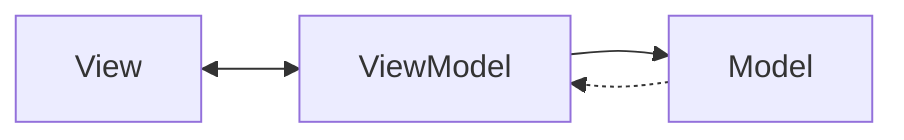

# Описание программы #
Программа для построения сплайна с помощью эрмитовых базисных функций. Для реализации идеи была использована платформа WPF ([``Windows Presentation Foundation``](https://docs.microsoft.com/en-us/visualstudio/designers/getting-started-with-wpf?view=vs-2022)) на базе шаблона проектирования MVVM ([``Model-View-ViewModel``](https://en.wikipedia.org/wiki/Model%E2%80%93view%E2%80%93viewmodel)).

## Пример построения сплайна
